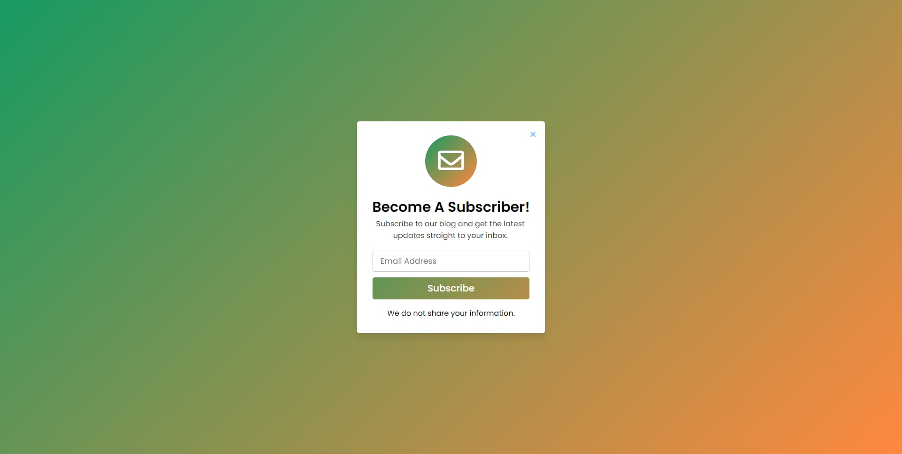

# Full Stack PHP Subscription Application

Modern Subscription Capture Form with Auto Send Email Confirmation



> Built with HTML, CSS, and PHP.

### Unique Project Points

> Sends Email to the Subscriber after Successful Capture

> You must download this project to test it on localhost and run index.php file.

> The production version is located within the production folder differs in that as well as sending an email to the client, this application also creates a database and posts the subscriber email to the database.

### Task List

- [x] Creating Modal Container For The PHP Form (HTML)
- [x] Styling the Modal (CSS)
- [x] Creating PHP Functions (PHP)
- [x] Create Database to Store the Email Addresses
- [x] Create PHP function to POST the email address' to the database.

<!--  -->
<!-- <a href="https://mogrady-git.github.io/HTML-Responsive-Email-Templates/index.html"></a> -->

## Installation Instructions for Testing on Localhost with Gmail

#### XAMPP - Go to the XAMPP installation directory and open the XAMPP folder and follow the below steps:

1. Go to the (C:\xampp\php) and open the php.ini or php file then find the mail function by scrolling down or simply press ctrl+f to search directly then find the following lines and pass these values:

#### PHP.INI FILE:

```
[mail function]
For Win32 only.
http://php.net/smtp
SMTP=smtp.gmail.com
http://php.net/smtp-port
smtp_port=587
sendmail_from = your_email_address_here
sendmail_path = "\"C:\xampp\sendmail\sendmail.exe\" -t"
```

2. Now, go the (C:\xampp\sendmail) and open the sendmail.ini then find sendmail by scrolling down or press ctrl+f to search directly then find the following lines and pass these values:

#### SENDMAIL.INI FILE:

```
smtp_server=smtp.gmail.com
smtp_port=587
error_logfile=error.log
debug_logfile=debug.log
auth_username=your_email_address_here
auth_password=your_password_here
```

3. Save all files and restart Apache Server from the XAMPP Panel and you're ready to go!

4. Open the index.php file. Fill in your email address and click submit. The email is now sent to your address with the following text:
   > Thanks for Subscribing to my Channel. You'll always recieve the latest updates from us. We won't share or sell your information to anyone.
5. A link on the index.php page will take you to the production version which in addition to the above, creates a database, table and posts the email
   to the database. To create the database and table, refresh the page twice and observe the notifications in the top panel. Now fill in email and it will
   be posted to the database as well as sent an confirmation email.

## Installation Instructions on Production Web Server

- [ ] To be included in private repo
- [ ] Database to be included in private repo
